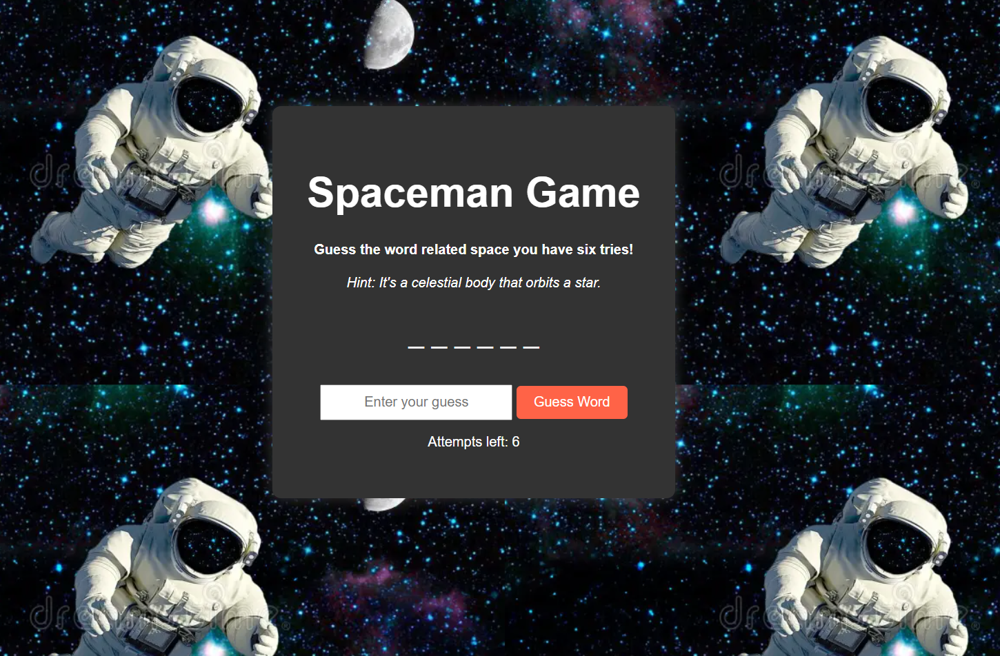

# Spaceman Game 
## Screenshot
Spaceman Game Screenshot 

## Game Description
### **Spaceman Game:** is a fun word-guessing game with a spaceman theme. The objective is to guess the correct word before running out of attempts. The player has six attempts to guess words related to space
### Why I Chose This Game: It's a game that lets us use the JavaScript skills we learned during the course, plus it's fun and lets us learn some space-related terms.
## Getting Started

## Deployed Game Link:
### [Play Spaceman Game](https://abbas22013.github.io/spaceman-game-project/)
## How to Play:
### 1. Enter a guess in the input field.
### 2. Click the "Guess Word" button to submit your guess.
### 3. You have **6 attempts** to guess the correct word.
### 4. If you guess the word correctly, you win. If you run out of attempts, you lose.
### 5. Restart the game by clicking the "Restart Game" button.

## Project Planning Materials:
### [Planning Materials](https://trello.com/b/L66In0Tg/project-1-planning)

## Attributions
### - **Background Image**: [Dreamstime](https://www.dreamstime.com/photos-images/spaceman.html).
### - **Font**: Google Fonts, **Arial**.

## Technologies Used:
- HTML5
- CSS3
- JavaScript
 - GitHub Pages

## Next Steps:
 - **Leaderboard**: Show a leaderboard with high scores.
- **Difficulty Levels**: Add an option to select difficulty levels.
- **Sound Effects**: Implement sound effects on guesses, For example if a player loses or wins.
- **Multiplayer mode:** Allows more than one player to play to increase competition and excitement.
